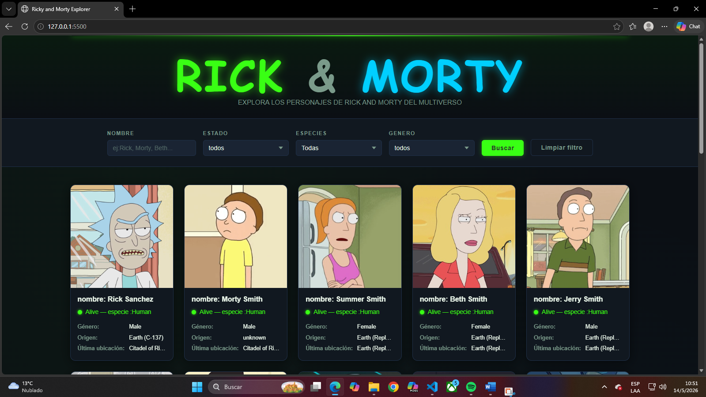
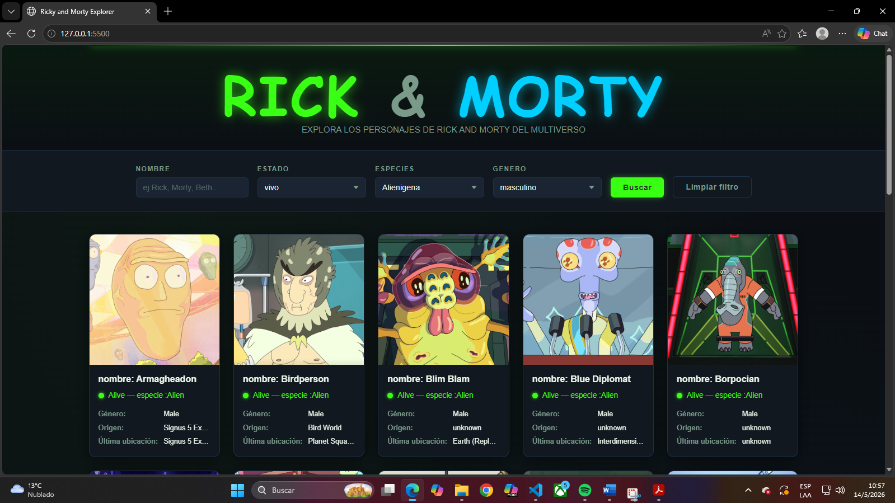

Descripción del Proyecto
Rick and Morty Explorer es una aplicación web interactiva que permite explorar y descubrir personajes del universo de la serie "Rick and Morty". Los usuarios pueden filtrar por nombre, estado vital, especie y género para encontrar exactamente el personaje que buscan.
La aplicación consume datos en tiempo real de la Rick and Morty API, ofreciendo una experiencia visual inmersiva con un tema visual basado en la serie (colores verde neón y cian). Este proyecto fue desarrollado como herramienta educativa para aprender sobre consumo de APIs REST, manipulación del DOM y desarrollo frontend moderno.

Integrantes
Acevedo, Lautaro
Oliver, Matias
Canello, Manuel

Tecnologías Utilizadas
Frontend
    •HTML5 - Estructura semántica y accesibilidad
    •CSS3 - Variables CSS, gradientes, animaciones
    •JavaScript (ES6+) - Módulos, async/await, Fetch API
APIs & Recursos
    •Rick and Morty API - Fuente de datos de personajes
    •Google Fonts - Bangers (títulos), Nunito (cuerpo)
Herramientas
    •Git & GitHub - Control de versiones
    •VS Code - Editor de código

Imagenes del proyecto

Funcionalidades Principales
    •Búsqueda por nombre - Filtra personajes escribiendo su nombre
    •Filtro por estado - Vivo, Muerto o Desconocido
    •Filtro por especie - Humano, Alienígena, Robot, Animal
    •Filtro por género - Masculino, Femenino, Sin género, Desconocido
    •Paginación - Navega entre páginas con botones
    •Responsive Design - Funciona en mobile, tablet y desktop
    •Carga Lazy - Las imágenes se cargan bajo demanda
    •Accesibilidad WCAG - ARIA labels, semantic HTML

Instrucciones para Ejecutar Localmente
Requisitos Previos
    •Navegador web moderno (Chrome, Firefox, Edge, Safari)
    •Conexión a Internet
    •Git (opcional, para clonar)
Abrir Directamente
Haz doble clic en index.html

API Utilizada
Rick and Morty API
URL: https://rickandmortyapi.com/api/character
Documentación: https://rickandmortyapi.com

Créditos
    •Rick and Morty API - rickandmortyapi.com
    •Fuentes: Google Fonts
    •Serie: Rick and Morty © Cartoon Network